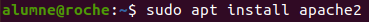

# Instal·lació de owncloud a Linux

Instalar Owncloud en Ubuntu 22.04 LTS.

## Instalar Apache:

Instalam el servidor Apache:
Per a instal·lar-lo haurem de fer la següent comanda


``` sudo apt install apache2 ```

Seguidament lo que haurem de fer serà desactivar el llistat de directoris del servidor amb la següent comanda:


``` sudo sed -i "s/Options Indexes FollowSymLinks/Options FollowSymLinks/" /etc/apache2/apache2.conf ```

# Instalar MariaDB:

Instalarem MariaDB:

``` sudo apt-get install mariadb-server mariadb-client -y ```

I configurem la instalació:

``` sudo mysql_secure_installation ```

Per últim reiniciem el servidor MariaDB.

``` sudo systemctl restart mariadb.service` o `sudo service mariadb.service restart ```

Crear la base de dades de owncloud:

Entrarem en MariaDB:

``` sudo mysql -u root -p ```

Creem la base de dades:

``` CREATE DATABASE owncloud; ```

Creem un usuari anomenat ownclouduser amb una contrasenya que podría ser Admin1234.

``` CREATE USER 'ownclouduser'@'localhost' IDENTIFIED BY 'Admin1234'; ```

Li donem acces al usuari a la base de dades creada:

``` GRANT ALL ON owncloud.* TO 'ownclouduser'@'localhost' IDENTIFIED BY 'Admin1234' WITH GRANT OPTION; ```

Apliquem els canvios i sortim:

``` FLUSH PRIVILEGES; ```

``` EXIT; ```

Per a contiunar haurem d'instalar PHP i els seus móduls necessaris:

``` sudo apt-get install software-properties-common -y ```

``` sudo add-apt-repository ppa:ondrej/php ```

Seguidament actualitzarem els paquets amb el repositori afegit:

```sudo apt update ```

Seguidament haurem d'instalamos PHP i els móduls necessaris:

``` sudo apt install php7.4 libapache2-mod-php7.4 php7.4-common php7.4-mbstring php7.4-xmlrpc php7.4-soap php7.4-apcu php7.4-smbclient php7.4-ldap php7.4-redis php7.4-gd php7.4-xml php7.4-intl php7.4-json php7.4-imagick php7.4-mysql php7.4-cli php7.4-mcrypt php7.4-ldap php7.4-zip php7.4-curl -y ```

Després de la instalació editarem el ficher php.ini i cambiarem alguns valors:

``` sudo nano /etc/php/7.1/apache2/php.ini ```

Els valors que hem de canviar son els següents:

``` file_uploads = On allow_url_fopen = On memory_limit = 256M upload_max_filesize = 100M display_errors = Off date.timezone = Europe/Madrid ```

Instalem Owncloud:
Descarguem la última versió del programma y descomprimim els fichers, ademés movem els archius de Owncloud a "/var/www/html/owncloud".

```cd /tmp && wget https://download.owncloud.com/server/stable/owncloud-complete-latest.zip ```
``` unzip owncloud-10.0.8.zip ```
``` sudo mv owncloud /var/www/html/owncloud/ ```

Seguidament canviem el propietari i els permisos dels directoris d'owncloud. www-data per a que es puguin usar Apache, 755 per a que es puguin executar i llegir cualsevol usuari de Linux:

``` sudo chown -R www-data:www-data /var/www/html/owncloud/ ```
``` do chmod -R 755 /var/www/html/owncloud/ ```

Seguidament passarem a configurar l'Apache

``` sudonano /etc/apache2/sites-available/owncloud.conf ```

Haurem de deixar un ficher com el següent, pero canviem el ServerName i el ServerAlies per los noms i alies del nostre propi dominio.

Instalació owncloud

Habilitem owncloud y el módul rewrite:

``` sudo a2ensite owncloud.conf ```

``` sudo a2enmod rewrite ```

``` sudo a2enmod headers ```

``` sudo a2enmod env ```

``` sudo a2enmod dir```

``` sudo a2enmod mime```

Seguidament haurem de reiniciar Apache:

``` sudo service Apache2 restart ```

A partir d'aquest moment podem accedir a owncloud desde el navegador per a fer-ho haurem d'introduir la nostra IP seguida de "/owncloud" amb el mateix, per exemple si la nostra IP es 172.31.84.197 posarem al navegador 172.31.84.197/owncloud i podrem accedir al servici.

Llavors al navegador creem una cuenta d'administració i posem les dades de MariaDB que hem configurat anteriorment.

### Accedir a Owncloud desde l'exterior del nostre equip

Podem accedir al nostre owncloud des de la xarxa local o des d'Internet, per a Internet hauràs de conèixer la IP pública de l'equip o de l'encaminador sota el que està.estro owncloud desde la red local o desde Internet, para Internet deberás conocer la IP pública del equipo o del router bajo el que está.

### Accedir desde LAN

Per accedir des de LAN haurem d'indicar al fitxer de configuració d'owncloud la IP de l'equip on s'allotja:

Busquem el ficher config.php y l'editem.

Al camp trusted domains afegim la IP de l'equip que fa de servidor.

Quedaría una cosa així:

Instalació owncloud:

On la IP seria la del nostre equip servidor en comptes de 192.168.1.133.

Ara ja podríem accedir a Owncloud des de qualsevol equip a la mateixa xarxa.
